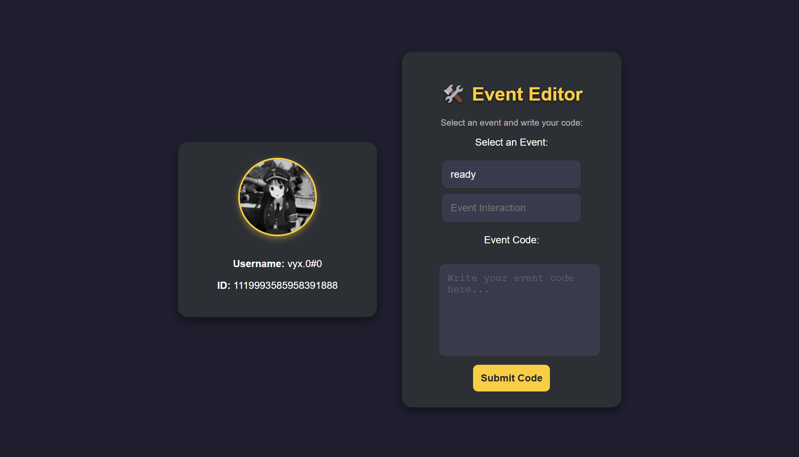

# Selfer - Discord Selfbot

A powerful self-bot built with Electron and Discord.js for automation and interaction. With Selfer, you can automate various tasks on Discord by logging in with your Discord token and writing custom event-driven code.

## Features

- **Discord Selfbot**: Automate your Discord experience by logging in using your token.
- **Event Editor**: Customize your bot’s behavior by writing code for Discord.js events like `messageCreate` or `ready`.
- **Responsive Design**: Access the bot's interface on both desktop and mobile screens.

## Screenshots

### Main Screen


### After Login



## Getting Started

### Prerequisites

To run this project locally, you need to have the following installed:

- **Node.js** (version 16 or higher)
- **npm** (comes with Node.js)
- **Electron** (for running the Electron app)

### Installation

1. **Clone the repository**:

   ```bash
   git clone https://github.com/RlxChap2/selfer.git
   cd selfer
   ```

2. **Install dependencies**:

   ```bash
   npm install
   ```

3. **Start the app**:

   ```bash
   npm start
   ```

   This will launch the Electron app.

### Usage

1. **Login with your Discord token**: Once the app is launched, enter your Discord token and click the "Login" button.
2. **Write Event Code**: After logging in, you’ll have access to the Event Editor. Select an event (e.g., `messageCreate`), write your event-driven code, and submit it to be executed.

## Scripts

- **`npm start`**: Starts the Electron app.
- **`npm run dev`**: Runs the Electron app in development mode.
- **`npm run build`**: Packages the app using `electron-builder`.
- **`npm run lint`**: Lints the code using ESLint.
- **`npm run prettify`**: Formats the code using Prettier.

## Contributing

1. Fork the repository.
2. Create a new branch (`git checkout -b feature/your-feature`).
3. Commit your changes (`git commit -am 'Add feature'`).
4. Push to the branch (`git push origin feature/your-feature`).
5. Open a pull request.

## License

This project is licensed under the MIT License - see the [LICENSE](LICENSE) file for details.

## Acknowledgements

- **Electron**: Framework for building cross-platform desktop applications with web technologies.
- **Discord.js**: A powerful library for interacting with the Discord API.
- **discord.js-self-bot**: A powerful library for interacting with the discord.js-self-bot API.
- **Prettier**: Code formatter to maintain code style consistency.
- **ESLint**: Linter for identifying and fixing problems in JavaScript code.
